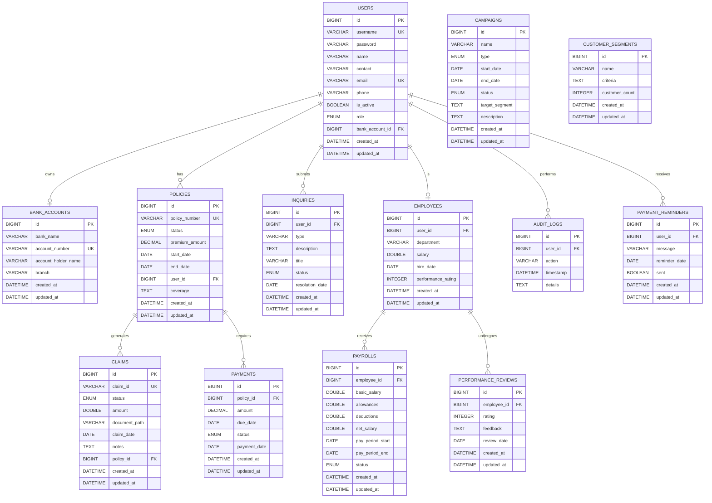

# Lanka Health Insurance - Entity Relationship Diagram

## Database Schema Overview

## Entity Descriptions

### Core Entities

**USERS**
- Primary entity representing all system users (customers, employees, admins)
- Contains authentication and contact information
- Links to bank accounts for payment processing

**POLICIES** 
- Insurance policies purchased by customers
- Contains coverage details, premium amounts, and validity periods
- Central entity linking customers to claims and payments

**CLAIMS**
- Insurance claims submitted by policyholders
- Tracks claim processing workflow with status updates
- Links to policies and contains supporting documentation

**PAYMENTS**
- Premium payments and claim disbursements
- Tracks payment status and due dates
- Links to policies for premium tracking

### Supporting Entities

**BANK_ACCOUNTS**
- Customer banking information for payments
- One-to-one relationship with users
- Used for claim disbursements and premium collections

**INQUIRIES**
- Customer support tickets and inquiries
- Tracks resolution status and customer communications
- Links to users for customer service management

**EMPLOYEES**
- Staff information extending user entity
- Contains HR-specific data like salary and department
- Links to payroll and performance management

### Administrative Entities

**CAMPAIGNS**
- Marketing campaigns and promotions
- Tracks campaign lifecycle and target segments
- Used for customer acquisition and retention

**AUDIT_LOGS**
- System activity tracking for compliance
- Records user actions and system events
- Essential for security and regulatory requirements

**CUSTOMER_SEGMENTS**
- Marketing segmentation for targeted campaigns
- Groups customers based on criteria
- Supports personalized marketing efforts

## Key Relationships

1. **User-Policy (1:N)**: Users can have multiple insurance policies
2. **Policy-Claim (1:N)**: Each policy can generate multiple claims
3. **Policy-Payment (1:N)**: Policies require multiple premium payments
4. **User-BankAccount (1:1)**: Each user has one bank account for transactions
5. **User-Employee (1:1)**: Staff users have extended employee information
6. **Employee-Payroll (1:N)**: Employees receive multiple payroll records
7. **User-Inquiry (1:N)**: Users can submit multiple support inquiries

## Enums and Status Values

**Role**: ADMIN, HR_MANAGER, MARKETING_MANAGER, CUSTOMER_SUPPORT, POLICYHOLDER, CLAIMS_EXECUTIVE
**PolicyStatus**: ACTIVE, EXPIRED, CANCELLED, SUSPENDED
**ClaimStatus**: PENDING, UNDER_REVIEW, APPROVED, PAID, REJECTED
**PaymentStatus**: PENDING, COMPLETED, FAILED, OVERDUE
**InquiryStatus**: OPEN, IN_PROGRESS, RESOLVED, CLOSED
**CampaignStatus**: DRAFT, ACTIVE, PAUSED, COMPLETED, CANCELLED
**CampaignType**: EMAIL, SOCIAL_MEDIA, SMS, DIRECT_MAIL

## Database Constraints

- All primary keys are auto-generated BIGINT
- Unique constraints on username, email, policy_number, claim_id, account_number
- Foreign key constraints maintain referential integrity
- Audit fields (created_at, updated_at) track record lifecycle
- Enum constraints ensure data consistency for status fields