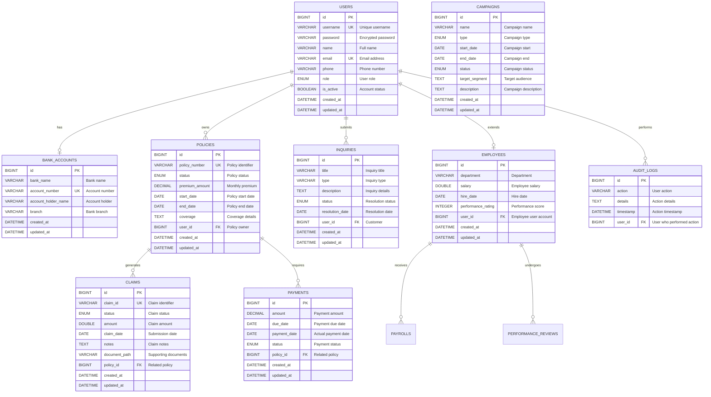

# Lanka Health Insurance - System Design

## 4. Design

### System Design Overview

The Lanka Health Insurance Online system is designed as a comprehensive web-based platform that facilitates seamless interaction between multiple stakeholders in the health insurance ecosystem. The design follows modern software engineering principles, incorporating user-centered design, scalable architecture, and robust security measures.

### Use Case Diagram

#### Primary Actors and Their Interactions

```mermaid
graph TB
    %% Actors
    Customer[👤 Customer/Policyholder]
    Admin[👨‍💼 System Administrator]
    HR[👩‍💼 HR Manager]
    Marketing[📊 Marketing Manager]
    Support[🎧 Customer Support]
    Claims[📋 Claims Executive]
    
    %% System Boundary
    subgraph "Lanka Health Insurance System"
        %% Authentication Use Cases
        Login[🔐 Login to System]
        Logout[🚪 Logout]
        ManageProfile[👤 Manage Profile]
        
        %% Policy Management Use Cases
        ViewPolicies[📄 View Policies]
        PurchasePolicy[🛒 Purchase Policy]
        RenewPolicy[🔄 Renew Policy]
        CancelPolicy[❌ Cancel Policy]
        
        %% Claims Management Use Cases
        SubmitClaim[📝 Submit Claim]
        TrackClaim[👁️ Track Claim Status]
        ReviewClaim[🔍 Review Claims]
        ApproveClaim[✅ Approve/Reject Claim]
        ProcessPayment[💳 Process Payment]
        
        %% Payment Management Use Cases
        MakePayment[💰 Make Premium Payment]
        ViewPaymentHistory[📊 View Payment History]
        SetupAutoPayment[⚙️ Setup Auto Payment]
        
        %% Customer Support Use Cases
        SubmitInquiry[❓ Submit Inquiry]
        RespondInquiry[💬 Respond to Inquiry]
        ViewInquiries[📋 View All Inquiries]
        
        %% Administrative Use Cases
        ManageUsers[👥 Manage Users]
        GenerateReports[📈 Generate Reports]
        ViewAnalytics[📊 View Analytics]
        SystemConfig[⚙️ System Configuration]
        
        %% HR Management Use Cases
        ManageEmployees[👨‍💼 Manage Employees]
        ProcessPayroll[💵 Process Payroll]
        PerformanceReview[⭐ Performance Reviews]
        
        %% Marketing Use Cases
        CreateCampaign[📢 Create Marketing Campaign]
        ManageSegments[🎯 Manage Customer Segments]
        ViewCampaignAnalytics[📈 View Campaign Analytics]
    end
    
    %% Customer Interactions
    Customer --> Login
    Customer --> ViewPolicies
    Customer --> PurchasePolicy
    Customer --> SubmitClaim
    Customer --> TrackClaim
    Customer --> MakePayment
    Customer --> ViewPaymentHistory
    Customer --> SubmitInquiry
    Customer --> ManageProfile
    Customer --> Logout
    
    %% Claims Executive Interactions
    Claims --> Login
    Claims --> ReviewClaim
    Claims --> ApproveClaim
    Claims --> ProcessPayment
    Claims --> GenerateReports
    Claims --> Logout
    
    %% Admin Interactions
    Admin --> Login
    Admin --> ManageUsers
    Admin --> SystemConfig
    Admin --> GenerateReports
    Admin --> ViewAnalytics
    Admin --> Logout
    
    %% HR Manager Interactions
    HR --> Login
    HR --> ManageEmployees
    HR --> ProcessPayroll
    HR --> PerformanceReview
    HR --> GenerateReports
    HR --> Logout
    
    %% Marketing Manager Interactions
    Marketing --> Login
    Marketing --> CreateCampaign
    Marketing --> ManageSegments
    Marketing --> ViewCampaignAnalytics
    Marketing --> GenerateReports
    Marketing --> Logout
    
    %% Customer Support Interactions
    Support --> Login
    Support --> ViewInquiries
    Support --> RespondInquiry
    Support --> ManageUsers
    Support --> Logout
```



#### Use Case Descriptions

**UC-001: Customer Policy Management**
- **Primary Actor**: Customer/Policyholder
- **Goal**: Manage insurance policies and coverage
- **Preconditions**: User must be authenticated
- **Main Flow**: 
  1. Customer logs into the system
  2. Views available policies or current policies
  3. Selects policy for purchase/renewal/modification
  4. Completes payment process
  5. Receives policy confirmation

**UC-002: Claims Processing Workflow**
- **Primary Actor**: Customer, Claims Executive
- **Goal**: Process insurance claims from submission to payment
- **Preconditions**: Valid policy exists
- **Main Flow**:
  1. Customer submits claim with supporting documents
  2. System validates claim against policy
  3. Claims executive reviews and processes claim
  4. Decision is made (approve/reject)
  5. If approved, payment is processed
  6. Customer receives notification of outcome

**UC-003: Administrative Management**
- **Primary Actor**: System Administrator
- **Goal**: Manage system users, configuration, and monitoring
- **Preconditions**: Admin privileges required
- **Main Flow**:
  1. Admin accesses administrative dashboard
  2. Performs user management operations
  3. Configures system settings
  4. Monitors system performance and generates reports

### Database Design / ER Diagram

#### Entity Relationship Model



#### Database Design Principles

**Normalization Strategy**
- **Third Normal Form (3NF)**: All entities are normalized to eliminate redundancy
- **Foreign Key Constraints**: Maintain referential integrity across all relationships
- **Unique Constraints**: Ensure data uniqueness for critical fields (username, email, policy numbers)

**Indexing Strategy**
- **Primary Keys**: Auto-generated BIGINT for optimal performance
- **Foreign Keys**: Indexed for efficient join operations
- **Search Fields**: Indexed on frequently searched columns (email, policy_number, claim_id)

**Data Types and Constraints**
- **Enums**: Used for status fields to ensure data consistency
- **Timestamps**: Audit fields for tracking record lifecycle
- **Decimal**: Precise monetary calculations for financial data
- **Text Fields**: Flexible storage for descriptions and notes

### UI Sketches/Screenshots and Descriptions

#### 4.1 Login and Authentication Interface

**Design Philosophy**: Clean, professional interface with company branding
- **Layout**: Centered login form with gradient background
- **Security Features**: Password encryption, session management, CSRF protection
- **Responsive Design**: Mobile-optimized layout
- **Accessibility**: Screen reader compatible, keyboard navigation

**Key Elements**:
- Company logo and branding
- Username/password input fields with validation
- "Remember Me" checkbox for convenience
- Forgot password link for account recovery
- Role-based redirection after successful login

#### 4.2 Customer Portal Dashboard

**Design Concept**: Modern glass-morphism design with intuitive navigation

**Dashboard Layout**:
```
┌─────────────────────────────────────────────────────────┐
│                    Header Navigation                    │
│  [Logo] Lanka Health Insurance    [Profile] [Logout]   │
├─────────────────────────────────────────────────────────┤
│                                                         │
│  ┌─────────┐ ┌─────────┐ ┌─────────┐ ┌─────────────┐   │
│  │ Policy  │ │ Claims  │ │Payments │ │   Profile   │   │
│  │   📄    │ │   📋    │ │   💳    │ │     👤      │   │
│  │ Manager │ │ Center  │ │ History │ │  Settings   │   │
│  └─────────┘ └─────────┘ └─────────┘ └─────────────┘   │
│                                                         │
│  ┌─────────────────────────────────────────────────┐   │
│  │              Policy Summary                     │   │
│  │  Active Policies: 2    Claims Pending: 1       │   │
│  │  Next Payment: $150    Coverage: $50,000       │   │
│  └─────────────────────────────────────────────────┘   │
│                                                         │
│  ┌─────────────────────────────────────────────────┐   │
│  │              Recent Activity                    │   │
│  │  • Claim CLM-001 submitted (Pending)           │   │
│  │  • Payment of $150 due on 2024-02-15          │   │
│  │  • Policy POL-123 renewed successfully         │   │
│  └─────────────────────────────────────────────────┘   │
└─────────────────────────────────────────────────────────┘
```

**Key Features**:
- **3D Glass Navigation Buttons**: Interactive buttons with hover effects and smooth animations
- **Real-time Data Display**: Live updates of policy status, claims, and payments
- **Quick Action Cards**: One-click access to common tasks
- **Notification Center**: Important alerts and reminders
- **Responsive Grid Layout**: Adapts to different screen sizes

#### 4.3 Claims Processing Interface

**Professional Dashboard for Claims Executives**

**Interface Layout**:
```
┌─────────────────────────────────────────────────────────┐
│  Claims Processing Dashboard                            │
├─────────────────────────────────────────────────────────┤
│ [Submit] [Review] [Search] [Reports]                    │
├─────────────────────────────────────────────────────────┤
│                                                         │
│  Submit New Claim Tab:                                  │
│  ┌─────────────────────────────────────────────────┐   │
│  │  Customer Search: [Search Box] [Search] [All]   │   │
│  │                                                 │   │
│  │  Customer Table:                                │   │
│  │  ID | Name | Email | Phone | Policy | Action   │   │
│  │  ---|------|-------|-------|--------|--------   │   │
│  │  1  | John | j@... | 555.. | POL-1  | Select   │   │
│  └─────────────────────────────────────────────────┘   │
│                                                         │
│  ┌─────────────────────────────────────────────────┐   │
│  │  Claim Submission Form:                         │   │
│  │  User ID: [Auto-filled]                        │   │
│  │  Policy Number: [Auto-filled]                  │   │
│  │  Claim Amount: [Input]                         │   │
│  │  Claim Date: [Date Picker]                     │   │
│  │  Description: [Text Area]                      │   │
│  │  [Submit Claim] [Clear Form]                   │   │
│  └─────────────────────────────────────────────────┘   │
└─────────────────────────────────────────────────────────┘
```

**Advanced Features**:
- **Multi-tab Interface**: Organized workflow for different claim operations
- **Customer Search Integration**: Real-time customer lookup with auto-fill
- **Document Upload**: Secure file upload with validation
- **Status Workflow Management**: Visual status progression indicators
- **Payment Processing Integration**: Bank account verification and payment processing

#### 4.4 Administrative Dashboards

**Role-Specific Interfaces**

**Admin System Settings**:
- **User Management Grid**: Add, edit, deactivate users with role assignment
- **System Configuration Panel**: Application settings and parameters
- **Analytics Dashboard**: Key performance indicators and system metrics
- **Audit Log Viewer**: Security and compliance monitoring

**HR Manager Portal**:
- **Employee Directory**: Comprehensive employee information management
- **Payroll Processing Interface**: Salary calculation and payment processing
- **Performance Review System**: Employee evaluation and feedback management
- **Department Analytics**: HR metrics and reporting

**Marketing Manager Dashboard**:
- **Campaign Builder**: Visual campaign creation with drag-and-drop interface
- **Customer Segmentation Tools**: Advanced filtering and targeting options
- **Analytics and Reporting**: Campaign performance metrics and ROI analysis
- **A/B Testing Interface**: Campaign optimization tools

#### 4.5 Policy Management Interface

**Comprehensive Policy Information Display**

**Policy Cards Layout**:
```
┌─────────────────────────────────────────────────────────┐
│                    Policy Information                   │
├─────────────────────────────────────────────────────────┤
│                                                         │
│  ┌─────────────────┐ ┌─────────────────┐ ┌───────────┐ │
│  │   Policy #1     │ │   Policy #2     │ │    Add    │ │
│  │   POL-12345     │ │   POL-67890     │ │    New    │ │
│  │                 │ │                 │ │  Policy   │ │
│  │ Health Coverage │ │ Dental Coverage │ │     +     │ │
│  │ Premium: $150   │ │ Premium: $50    │ │           │ │
│  │ Status: Active  │ │ Status: Active  │ │           │ │
│  │                 │ │                 │ │           │ │
│  │ [View Details]  │ │ [View Details]  │ │ [Browse]  │ │
│  │ [Make Payment]  │ │ [Make Payment]  │ │           │ │
│  └─────────────────┘ └─────────────────┘ └───────────┘ │
│                                                         │
│  Policy Details Expansion:                              │
│  ┌─────────────────────────────────────────────────┐   │
│  │ Coverage Details:                               │   │
│  │ • Hospital Admission: $10,000 per incident     │   │
│  │ • Outpatient Care: $2,000 per year            │   │
│  │ • Prescription Drugs: 80% coverage            │   │
│  │ • Emergency Services: 100% coverage           │   │
│  │                                               │   │
│  │ Payment Schedule:                             │   │
│  │ Next Payment: February 15, 2024 - $150       │   │
│  │ Payment Method: Auto-debit from Bank Account  │   │
│  └─────────────────────────────────────────────────┘   │
└─────────────────────────────────────────────────────────┘
```

#### 4.6 Mobile Responsive Design

**Mobile-First Approach**

**Responsive Breakpoints**:
- **Desktop**: 1200px+ (Full feature set)
- **Tablet**: 768px-1199px (Optimized layout)
- **Mobile**: <768px (Touch-optimized interface)

**Mobile Optimizations**:
- **Collapsible Navigation**: Hamburger menu for space efficiency
- **Touch-Friendly Buttons**: Larger touch targets for mobile interaction
- **Swipe Gestures**: Intuitive navigation between sections
- **Optimized Forms**: Single-column layout with large input fields
- **Progressive Loading**: Lazy loading for improved performance

#### 4.7 Design System and Consistency

**Color Palette**:
- **Primary Green**: #09573d (Headers, primary actions)
- **Accent Green**: #2bc579 (Highlights, success states)
- **Light Gray**: #f6fff7 (Background, cards)
- **Border Gray**: #bdebbd (Borders, dividers)
- **Text Colors**: Various shades for hierarchy and readability

**Typography**:
- **Primary Font**: Assistant (Google Fonts)
- **Font Weights**: 300-800 for proper hierarchy
- **Font Sizes**: Responsive scaling from 0.75rem to 2rem
- **Letter Spacing**: Enhanced readability with proper spacing

**Component Library**:
- **Glass Cards**: Consistent card design with subtle transparency
- **Form Elements**: Standardized input fields, buttons, and validation
- **Navigation Components**: Unified navigation patterns across all interfaces
- **Status Indicators**: Color-coded status badges and progress indicators

This comprehensive design document establishes the foundation for a user-centered, scalable, and maintainable health insurance management system that meets the needs of all stakeholders while maintaining high standards of usability and accessibility.